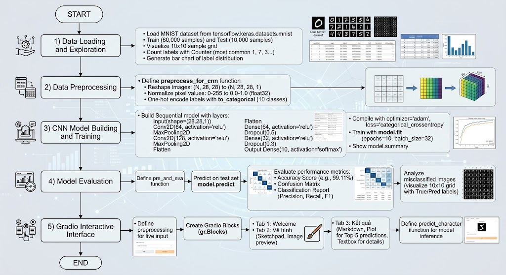
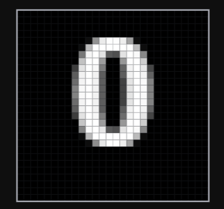
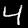
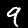

## Nhận diện Chữ số viết tay (MNIST Classification) 

Một dự án Trí tuệ Nhân tạo (AI) cơ bản giúp phân loại và nhận diện các chữ số viết tay từ 0 đến 9 sử dụng bộ dữ liệu kinh điển MNIST. 

## Trực quan hóa dữ liệu (Data Visualization)
Dưới đây là mô phỏng cách máy tính "nhìn" các chữ số từ 0 đến 9 dưới dạng ma trận điểm ảnh (pixel):

| 0 | 1 | 2 | 3 | 4 |
|:---:|:---:|:---:|:---:|:---:|
|  |  |  |  |  |

| 5 | 6 | 7 | 8 | 9 |
|:---:|:---:|:---:|:---:|:---:|
|  |  |  |  |  |

## Công nghệ sử dụng (Tech Stack) 
*   **Ngôn ngữ:** Python 3.13 
*   **Môi trường:** Jupyter Notebook (VS Code) 
*   **Thư viện xử lý & Học máy:** Numpy, Pandas, Scikit-learn, TensorFlow 
*   **Thư viện trực quan hóa:** Matplotlib, Seaborn 

## Cấu trúc dự án 
*   `.venv/` : Môi trường ảo (đã được ẩn bởi .gitignore) 
*   `notebook.ipynb` : Chứa toàn bộ mã nguồn xử lý dữ liệu, huấn luyện và vẽ biểu đồ. 
*   `README.md` : Tài liệu hướng dẫn. 

## Nguồn tham khảo 
*  [Video hướng dẫn](https://www.youtube.com/watch?v=SrCLwV0TfB0) 

## Giảng viên hướng dẫn 
* Th.S Huỳnh Hoàng Hà 

## Tiến độ 
- Tuần 1: Chạy mô hình và tìm hiểu các khái niệm liên quan 