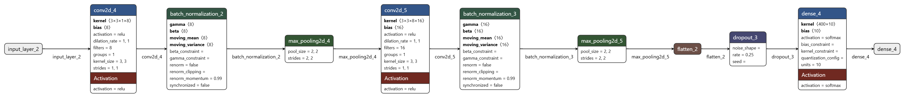

<div align="center">
  [cite: 24]
</div>

# AI-MNIST: Hardware-Friendly CNN Accelerator 🚀

Dự án này tập trung vào việc nghiên cứu, phát triển và tối ưu hóa mạng nơ-ron tích chập (CNN) để phân loại bộ dữ liệu chữ số viết tay MNIST. Điểm cốt lõi của dự án không chỉ dừng lại ở việc huấn luyện mô hình phần mềm mà là xây dựng một hệ thống **Hardware-friendly** (thân thiện với phần cứng) nhằm chuẩn bị cho quá trình thiết kế và triển khai xuống vi mạch chuyên dụng (FPGA / ASIC).

## 📌 Các tính năng và Giai đoạn cốt lõi

*   🧠 **Giai đoạn 1: Xây dựng & Huấn luyện (Python/Keras):** Thiết kế mạng CNN bao gồm các khối Conv2D, Batch Normalization, MaxPooling2D và Dense. Đạt độ chính xác cao (~98.88%) trên tập test.
*   ⚙️ **Giai đoạn 2: Tối ưu hóa Hardware-Friendly:** Chủ động loại bỏ lớp kích hoạt Softmax (tránh phép tính $e^x$ phức tạp và tốn kém tài nguyên phần cứng). Thay vào đó, mô hình chỉ xuất ra giá trị tuyến tính thô (Logits) và sử dụng hàm `Argmax` để xác định nhãn dự đoán.
*   📦 **Giai đoạn 3: Trích xuất tham số (Parameter Extraction):** Duỗi thẳng (flatten) toàn bộ trọng số (Weights, Bias) và tham số chuẩn hóa (Gamma, Beta, Mean, Variance) thành mảng 1 chiều và xuất ra định dạng `.txt` độc lập.
*   💻 **Giai đoạn 4: C/C++ Golden Model (Inference):** Xây dựng một chương trình C/C++ thuần túy, nạp trọng số và ảnh đầu vào từ file `.txt` để chạy suy luận (Forward Pass) thông qua các vòng lặp ma trận. Đây là bản tham chiếu vàng để đối chiếu độ chính xác 1-1 trước khi tiến hành viết code RTL cho FPGA.

## 📂 Cấu trúc Repository

```text
├── image_0.png -> image_9.png     # Các ảnh test được trích xuất từ tập MNIST
├── input_image.txt                # Ảnh đầu vào đã được duỗi thẳng (1D) để nạp vào C/C++
├── conv1_weights.txt, ...         # Các file trọng số và bias của lớp Conv2D
├── bn1_gamma.txt, bn1_beta.txt... # Các tham số thống kê của lớp Batch Normalization
├── dense_weights.txt, ...         # Các file trọng số và bias của lớp phân loại Dense cuối
├── Training step.ipynb            # Notebook huấn luyện mô hình và trích xuất trọng số
├── Inference step.ipynb           # Notebook kiểm chứng toán học bằng NumPy (không dùng hàm predict)
├── mnist_cnn_model.keras          # File mô hình đã được huấn luyện
├── Golden Model AI.c              # Mã nguồn C thuần thực thi Inference
└── Baocao.docx                    # Tài liệu báo cáo chi tiết thuật toán và kiến trúc